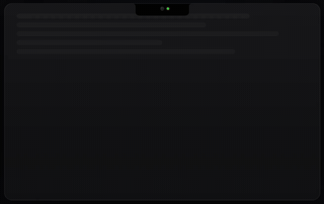

# Teleprompter

A macOS teleprompter app with real-time word tracking, auto-scroll, and voice-activated scrolling.

Built for streamers, presenters, interviewers, and podcasters who need a clean, distraction-free way to read scripts on camera.



## Features

- **Word Tracking** — On-device speech recognition highlights each word as you speak. Works offline, supports multiple languages.
- **Classic Auto-Scroll** — Constant-speed scrolling with adjustable speed (0.5–8 words/s). No microphone needed.
- **Voice-Activated Scroll** — Scrolls while you talk, pauses when you stop. Great for natural pacing.
- **Dynamic Island Overlay** — A notch-style overlay that sits above all apps, invisible to your audience.
- **Floating Window** — Draggable, always-on-top window with optional glass effect.
- **Fullscreen Mode** — Full teleprompter on any connected display.
- **Sidecar / External Display** — Mirror or extend to an iPad or external monitor. Supports mirror rigs with flipped output.
- **Remote Viewing** — View the teleprompter on any device (phone, tablet) via local network. Scan a QR code to connect instantly.
- **Director Mode** — Let someone else control and edit the script remotely from a browser in real time.
- **PowerPoint Import** — Drop a `.pptx` file to extract presenter notes as pages.
- **Multi-Page Support** — Navigate between pages with automatic advance.
- **Privacy First** — Everything runs locally. No accounts, no cloud, no tracking.

## Getting Started

### Requirements

- macOS 15+
- Xcode 16+
- Swift 5.0+

### Build & Run

```bash
git clone https://github.com/hamadhk7/teleprompter.git
cd teleprompter/Textream
open Textream.xcodeproj
```

Build and run with `⌘R` in Xcode.

### First Launch

macOS may block the app on first open since it's not from the App Store. Run this once:

```bash
xattr -cr /Applications/Textream.app
```

Then right-click the app and select **Open**.

## How It Works

1. Paste your script into the editor.
2. Hit play — the overlay appears at the top of your screen.
3. Start speaking — words highlight in real-time as you read.
4. When you finish, the overlay closes automatically.

## Project Structure

```
Textream/
├── Textream.xcodeproj
├── Info.plist
└── Textream/
    ├── TextreamApp.swift              # App entry point
    ├── ContentView.swift              # Main editor UI
    ├── TextreamService.swift          # Core service layer
    ├── SpeechRecognizer.swift         # On-device speech recognition
    ├── NotchOverlayController.swift   # Dynamic Island overlay
    ├── ExternalDisplayController.swift # External display output
    ├── NotchSettings.swift            # User preferences
    ├── SettingsView.swift             # Settings UI
    ├── MarqueeTextView.swift          # Word highlighting layout
    ├── BrowserServer.swift            # Remote connection server
    ├── DirectorServer.swift           # Director mode server
    ├── PresentationNotesExtractor.swift # PPTX notes extraction
    └── Assets.xcassets/               # App icon and colors
```

## URL Scheme

The app supports the `textream://` URL scheme:

```
textream://read?text=Hello%20world
```

You can also send text via the macOS Services menu from any app.

## Director Mode API

Director Mode runs an HTTP + WebSocket server on your local network for remote script control.

| Service | Default Port |
|---|---|
| HTTP (web UI) | `7575` |
| WebSocket | `7576` |

### Commands (Client → App)

**Start reading:**
```json
{ "type": "setText", "text": "Your script here..." }
```

**Edit while reading:**
```json
{ "type": "updateText", "text": "Updated script...", "readCharCount": 42 }
```

**Stop:**
```json
{ "type": "stop" }
```

### State (App → Client)

The server broadcasts state at ~10 Hz:

```json
{
  "words": ["Hello", "everyone"],
  "highlightedCharCount": 14,
  "totalCharCount": 120,
  "isActive": true,
  "isDone": false,
  "isListening": true
}
```

## License

MIT
